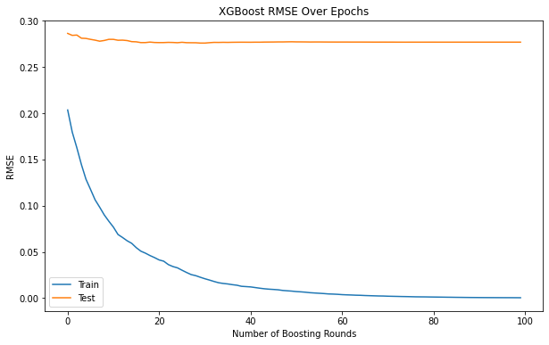

# LLM_StockPredictor
Project of Bagautdin Nukhkadiev and Ignatio Calvin Hidayat for the course "Machine Learning and Causal Inference" at the University of Mannheim.

## Overview
The impact of Natural Language Processing (NLP) algorithms in predicting
stock market prices, especially price shocks.

Commodity price shocks are times when the prices for commodities have
drastically increased or decreased over a short time. Typically, the stock market
and economic performance are aligned. Thus, when the stock market is performing well, it is usually a function of a growing economy.

Stock market declines have the potential to diminish wealth across personal
and retirement investment portfolios. Consequently, individuals witnessing a depreciation in their portfolio value are inclined to curtail their expenditures. 

With this project, we aim to develop a model that analyzes news headlines
and predicts stock market crashes based on text data. Having such a model may
help us anticipate the stock market movement to better manage our wealth and
prepare for adverse economic events. We chose to work with NLP algorithms and
fine-tune existing pre-trained LLMs, as classical autoregressive models show
poor predictive capacity during price shocks. Using textual data as input such
as news headlines may help the model adjust its predictions to keep up with
drastically changing trends. Aside from that, we used also analyzed the effects of sentiment analysis and moving averages as features used for prediction. The models are evaluated based on the root mean squared error (RMSE) of the predicted stock prices. 

## Data

The data is obtained from the Kaggle dataset [Daily News for Stock Market Prediction](https://www.kaggle.com/aaron7sun/stocknews). The dataset contains historical news headlines from Reddit WorldNews Channel and Dow Jones Industrial Average (DJIA) stock prices. The news headlines are from 2008 to 2016, and the stock prices are from 2008 to 2016. Combined_News_DJIA.csv contains the top 25 news headlines and the corresponding stock prices for each day. upload_DJIA_table.csv contains the stock prices for each day. 

The project is divided into the following sections:

## Notebooks

### 1. FinGPT Sentiment Retrieval
Filename: `retrieve_sentiment.ipynb`
Description: This notebook demonstrates the use of a LLM, specifically FinGPT, to retrieve and analyze sentiments of financial news articles using the LangChain framework. We asked FinGPT to generate a sentiment score for each news headline in the dataset. The sentiment score ranges from -10 to 10, where -1 indicates a negative sentiment, 0 indicates a neutral sentiment, and 1 indicates a positive sentiment.

### 2. Univariate Model
Filename: `univariate.ipynb`
Description: This notebook focuses on using a LSTM neural network to predict stock prices based on a univariate time series.

### 3. Predicting Stock Prices with News Headlines without Looking Back at the Data
Filename: `news_rnn.ipynb`
Description: This notebook predicts stock prices using an LSTM neural network and financial news headlines which uses BERT embeddings. This uses the current news headlines and does not account for looking back at the previous stock prices and news headlines. It behaves poorly since it does not account for the data dependency, and it only uses current news headlines to predict the stock prices.

### 4. Predicting Stock Prices with News Headlines with Look Back
Filename: `lookback_news_rnn.ipynb`
Description: This notebook predicts stock prices using an LSTM neural network and financial news headlines which uses BERT embeddings. This uses a look back window of 50 days of news headlines and stock prices to predict the next day's stock price in the training data and a 30 day window in the testing data. The reason for a longer window is they provide more data points to learn from, allowing the model to capture long-term trends and dependencies.

Stock market dynamics can change over time, so a shorter test window ensures the model is evaluated on its ability to adapt to the most recent market conditions.

### 5. Predicting Stock Prices with News Headlines with Look Back and Sentiment Analysis
Filename: `sentiment_rnn.ipynb`
Description: Here, aside from using the look back window of 50 days of news headlines embeddings and stock prices to predict the next day's stock price, we also include sentiment analysis of the news headlines using FinGPT. The sentiment analysis gives a score from the range -10 to 10, where -10 is the most negative sentiment and 10 is the most positive sentiment. This score is then used as an additional feature in the model. 

### 6. Predicting Stock Prices with News Headlines with Look Back and Moving Average
Filename: `bert_MA.ipynb`
Description: In this notebook, we predict stock prices using an LSTM neural network and financial news headlines which uses BERT embeddings. We use a look back window of 50 days of news headlines and stock prices to predict the next day's stock price in the training data and a 30 day window in the testing data. We also include a moving average of the stock prices of 10 days as an additional feature in the model.

### 7. Predicting Stock Prices with FastText Embeddings
Filename: `lookback_fasttext.ipynb`
Description: This notebook predicts stock prices using an LSTM neural network and financial news headlines which uses FastText embeddings. We use a look back window of 50 days of news headlines and stock prices to predict the next day's stock price in the training data and a 30 day window in the testing data. The FastText embeddings are used as an alternative to BERT embeddings.

### 8. Predicting Stock Prices with XGBoost
Filename: `xgboost.ipynb`
Description: This notebook predicts stock prices using an XGBoost model. The model uses the stock prices and news headlines as features to predict the stock prices. The model is trained on the training data and evaluated on the testing data.

### 9. Predicting Stock Prices with XGBoost with Look Back
Filename: `lookback_xgboost.ipynb`
Description: This notebook predicts stock prices using an XGBoost model. The model uses a look back window of 50 days of stock prices and news headlines as features to predict the next day's stock price in the training data and a 30 day window in the testing data. The model is trained on the training data and evaluated on the testing data.

## Results
For our models, we used the RMSE as the evaluation metric. The RMSE is a measure of the differences between the predicted values and the actual values. It gives us an idea of how well the model is performing in terms of predicting the stock prices.

The table below shows the RMSE values for the training and testing data for each of the models.

| Notebooks 	        | Train RMSE 	        | Test RMSE 	    |
|:---:	                |:---:	                |:---:	            |
| univariate 	        | 31.74	                | 164.36 	        |
| xgboost 	            | 0.99 	                | 749.04	        |
| lookback_xgboost 	    | 3.56	                | 200.72	        |
| bert_MA 	            | 10.83	                | 816.58	        |
| news_rnn            	| 622.62 	            | 741.46	        |
| lookback_news_rnn 	| 15.45	                | 309.57	        |
| sentiment_rnn 	    | 27.86 	            | 1143.88	        |
| lookback_fasttext 	| 13.96 	            | 169.93	        |

   

| Notebooks 	        | Loss Graph 	                        | Test Predictions	                |
|:---:	                |:---:	                                |:---:	                            |
| univariate 	        |  	    | 	|
| xgboost 	            | 	    |   |
| lookback_xgboost 	    |       |   |
| bert_MA 	            |  	    |  	|
| news_rnn            	|        |  	|
| lookback_news_rnn 	|  	    |  	|
| sentiment_rnn 	    |        |  	|
| lookback_fasttext 	|  	    |  	|

### Discussion
From the results, we can see that the `univariate` model has the lowest RMSE value for the testing data, indicating that it is the best performing model among all of the models. The `lookback_xgboost` model has a lower RMSE value for the testing data compared to the `xgboost` model, indicating that the look back window helps improve the model's performance. The `news_rnn` model has high RMSE value for the testing data, indicating that it is the worst performing model among all of the models, because it doesn't have access to the price data. The `lookback_news_rnn` model has a lower RMSE value for the testing data compared to the `news_rnn` model, indicating that the look back window helps improve the model's performance. The `sentiment_rnn` model has the highest RMSE value for the training data, indicating that it may be underfitting the training data. The `lookback_fasttext` model has a lower RMSE value for the testing data compared to the `univariate` model, indicating that the FastText embeddings may be a better choice than the BERT embeddings for this task.

The news data can act as a tool to provide robustness to the prediction model by incorportating information that affects stock prices and also capturing the market sentiment, however, it can add noise to the feature set by being too abundant and not always relevant. The sentiment analysis can also be used to provide additional information about the market sentiment, but it may not always be accurate and can be subjective. Overall the fasttext embeddings and the univariate model performed equally well. 

For future work, the model can be further improved by incorporating more features such as technical indicators, economic indicators, and other relevant data sources. The model can also be improved by tuning the hyperparameters of the model and using more sophisticated models such as transformers and deep learning models.

